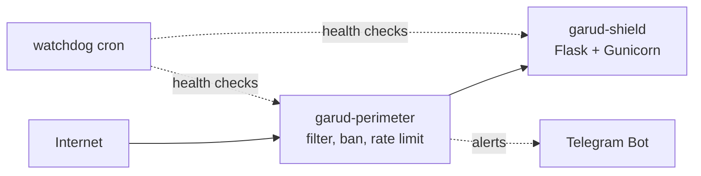
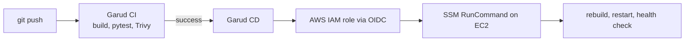
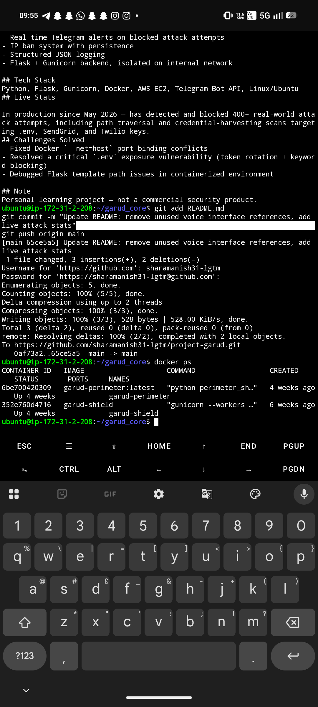
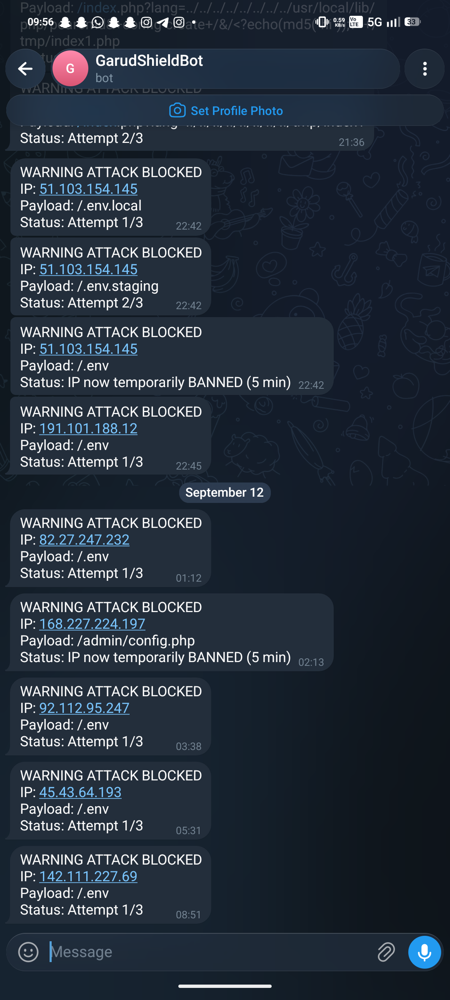
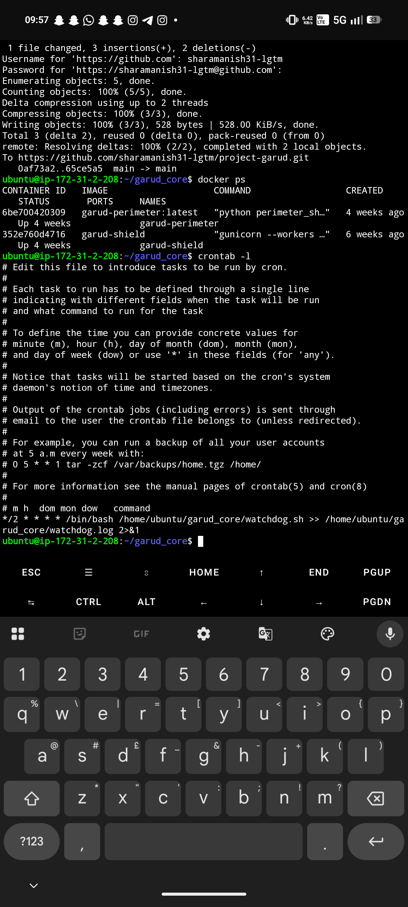
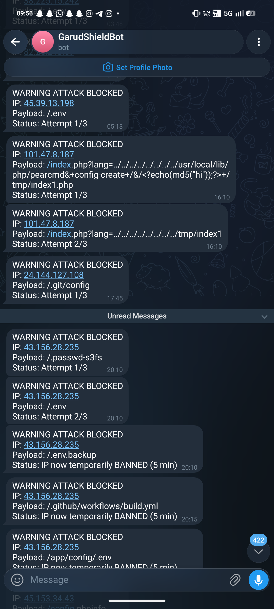

# Project Garud 🦅


 


A two-container security system on AWS EC2. A **perimeter** container filters traffic before it reaches the **Flask** application, bans repeat attackers, and sends real-time Telegram alerts. Every push is tested, scanned and deployed automatically.

**Live demo:** http://52.66.23.197 (voice interface: tap *Arm*, say "Hey Garud")

## Architecture



## CI/CD



- **CI:** builds both Docker images, runs pytest, scans each image with Trivy.
- **CD:** GitHub Actions assumes an AWS IAM role through OIDC and deploys via SSM. No SSH keys and no stored AWS credentials.
- **Code scanning:** CodeQL (Python and GitHub Actions), plus GitHub secret scanning and push protection.

## Features

- Regex-based request filtering (path traversal, `.env` and key-hunting scans)
- 3-strike IP banning stored in `data/bans.json`, persists across restarts and deploys
- Rate limiting, honeypot routes, and an owner-IP allowlist that is never banned
- Real-time Telegram alerts with a one-tap "sticky trap" (slow tarpit response) option
- Structured JSON logging
- Cron watchdog that alerts on DOWN / RECOVERED
- Voice interface: wake-word activated HUD with spoken responses (Web Speech API + pre-generated TTS)

## Problems I solved

| Problem | Fix |
|---|---|
| `COPY . .` baked `.env` (API tokens) into the Docker image | Added `.dockerignore`, verified with `docker exec` that secrets were gone |
| Compose build context was wrong and only worked through layer cache | Corrected context and Dockerfile paths |
| CI-only Compose overrides blanked secrets in production | Separate `docker-compose.prod.yml` override |
| Bans were memory-only, lost on restart | JSON persistence, then a bind-mounted `data/` volume so deploys keep it |
| Telegram alerts failed silently (malformed API URL hidden by a bare `except`) | Fixed the URL, verified alerts end-to-end |
| An offensive "counter-strike" payload option could hit shared or NAT IPs | Removed it, the system is defensive only |

## Screenshots

 

 

## Run locally

```bash
git clone https://github.com/sharamanish31-lgtm/project-garud.git
cd project-garud
cp .env.example .env    # fill in TELEGRAM_BOT_TOKEN, TELEGRAM_CHAT_ID, ...
docker compose up --build -d
```

Production deploys run through the CD workflow (`.github/workflows/cd.yml`).

## Roadmap

- HTTPS with a custom domain and reverse proxy
- Clap-to-wake (needs a secure origin)
- Human-approved rule suggestions via Telegram (the system never changes its own rules without asking)

## Tech

Python, Flask, Gunicorn, Docker, Docker Compose, GitHub Actions, Trivy, CodeQL, AWS EC2, IAM (OIDC), SSM, Bash, cron, Telegram Bot API.
